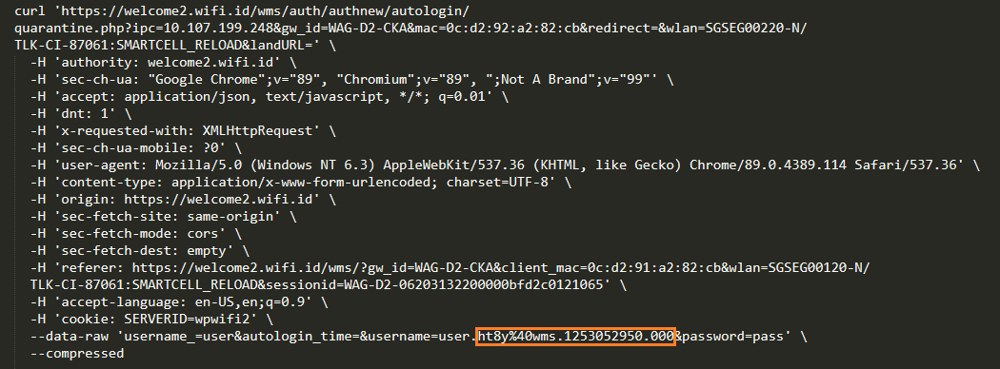
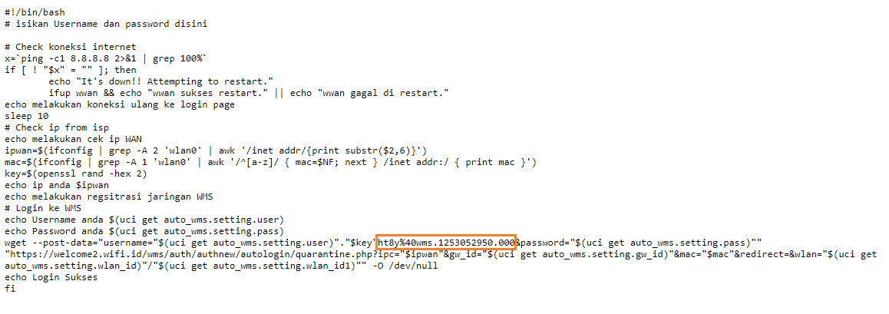

* installasi GUI AutoLogin WMS Venue Update 10-04-2021
```
$ opkg update && opkg install openssl-util libustream-openssl
$ wget --no-check-certificate https://raw.githubusercontent.com/portalssh/openwrt/main/wms/auto_wms && chmod 755 ./auto_wms && ./auto_wms install
$ mkdir -p /www/image
$ cd /www/image
$ wget --no-check-certificate https://github.com/portalssh/openwrt/raw/main/wms/config/logo3.png
$ wget --no-check-certificate https://github.com/portalssh/openwrt/raw/main/wms/config/favicon.png
$ cd
$ /etc/init.d/uhttpd restart
```

* Tampilan GUI AutoLogin "http://ip_router/cgi-bin/autowms"

<div  align="center">    
  
</div>

```
```
* contoh curl bash login page

<div  align="center">    
  
</div>

```
```
* Edit config "nano auto_wms"

<div  align="center">    
  
</div>

```
```
* CLI AutoLogin WMS Venue Update 10-04-2021
```
$ wget --no-check-certificate https://raw.githubusercontent.com/portalssh/openwrt/main/wms/config/wms_sh
```
* CLI AutoLogin WIFI.ID Update 10-04-2021
```
$ wget --no-check-certificate https://raw.githubusercontent.com/portalssh/openwrt/main/wms/config/wifi_id
```
